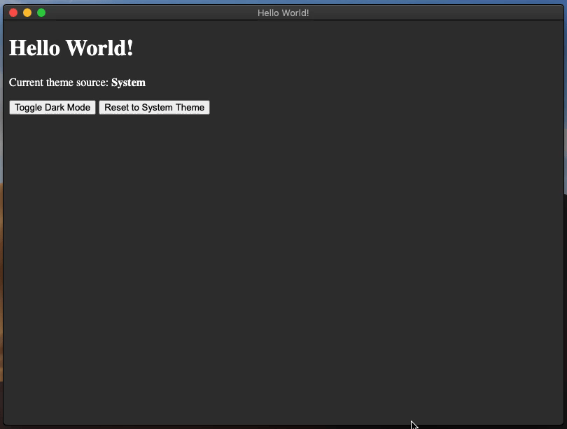

# Dark Mode

## Overview

### Automatically update the native interfaces

"Native interfaces" include the file picker, window border, dialogs, context
menus, and more - anything where the UI comes from your operating system and
not from your app. The default behavior is to opt into this automatic theming
from the OS.

### Automatically update your own interfaces

If your app has its own dark mode, you should toggle it on and off in sync with
the system's dark mode setting. You can do this by using the
[prefer-color-scheme] CSS media query.

### Manually update your own interfaces

If you want to manually switch between light/dark modes, you can do this by
setting the desired mode in the
[themeSource](../api/native-theme.md#nativethemethemesource)
property of the `nativeTheme` module. This property's value will be propagated
to your Renderer process. Any CSS rules related to `prefers-color-scheme` will
be updated accordingly.

## macOS settings

In macOS 10.14 Mojave, Apple introduced a new [system-wide dark mode][system-wide-dark-mode]
for all macOS computers. If your Electron app has a dark mode, you can make it
follow the system-wide dark mode setting using
[the `nativeTheme` api](../api/native-theme.md).

In macOS 10.15 Catalina, Apple introduced a new "automatic" dark mode option
for all macOS computers. In order for the `nativeTheme.shouldUseDarkColors` and
`Tray` APIs to work correctly in this mode on Catalina, you need to use Electron
`>=7.0.0`, or set `NSRequiresAquaSystemAppearance` to `false` in your
`Info.plist` file for older versions. Both [Electron Packager][electron-packager]
and [Electron Forge][electron-forge] have a
[`darwinDarkModeSupport` option][packager-darwindarkmode-api]
to automate the `Info.plist` changes during app build time.

If you wish to opt-out while using Electron &gt; 8.0.0, you must
set the `NSRequiresAquaSystemAppearance` key in the `Info.plist` file to
`true`. Please note that Electron 8.0.0 and above will not let you opt-out
of this theming, due to the use of the macOS 10.14 SDK.

## Example

We'll start with a working application from the
[Quick Start Guide](quick-start.md) and add functionality gradually.

First, let's edit our interface so users can toggle between light and dark
modes.  This basic UI contains buttons to change the `nativeTheme.themeSource`
setting and a text element indicating which `themeSource` value is selected.
By default, Electron follows the system's dark mode preference, so we
will hardcode the theme source as "System".

Add the following lines to the `index.html` file:

```html
<!DOCTYPE html>
<html>
<head>
    <meta charset="UTF-8">
    <title>Hello World!</title>
    <meta http-equiv="Content-Security-Policy" content="script-src 'self' 'unsafe-inline';" />
    <link rel="stylesheet" type="text/css" href="./styles.css">
</head>
<body>
    <h1>Hello World!</h1>
    <p>Current theme source: <strong id="theme-source">System</strong></p>

    <button id="toggle-dark-mode">Toggle Dark Mode</button>
    <button id="reset-to-system">Reset to System Theme</button>

    <script src="renderer.js"></script>
  </body>
</body>
</html>
```

Next, add [event listeners](https://developer.mozilla.org/en-US/docs/Web/API/EventTarget/addEventListener)
that listen for `click` events on the toggle buttons. Because the `nativeTheme`
module only exposed in the Main process, you need to set up each listener's
callback to use IPC to send messages to and handle responses from the Main
process:

* when the "Toggle Dark Mode" button is clicked, we send the
`dark-mode:toggle` message (event) to tell the Main process to trigger a theme
change, and update the "Current Theme Source" label in the UI based on the
response from the Main process.
* when the "Reset to System Theme" button is clicked, we send the
`dark-mode:system` message (event) to tell the Main process to use the system
color scheme, and update the "Current Theme Source" label to `System`.

To add listeners and handlers, add the following lines to the `renderer.js` file:

```javascript
const { ipcRenderer } = require('electron')

document.getElementById('toggle-dark-mode').addEventListener('click', async () => {
  const isDarkMode = await ipcRenderer.invoke('dark-mode:toggle')
  document.getElementById('theme-source').innerHTML = isDarkMode ? 'Dark' : 'Light'
})

document.getElementById('reset-to-system').addEventListener('click', async () => {
  await ipcRenderer.invoke('dark-mode:system')
  document.getElementById('theme-source').innerHTML = 'System'
})
```

If you run your code at this point, you'll see that your buttons don't do
anything just yet, and your Main process will output an error like this when
you click on your buttons:
`Error occurred in handler for 'dark-mode:toggle': No handler registered for 'dark-mode:toggle'`
This is expected — we haven't actually touched any `nativeTheme` code yet.

Now that we're done wiring the IPC from the Renderer's side, the next step
is to update the `main.js` file to handle events from the Renderer process.

Depending on the received event, we update the
[`nativeTheme.themeSource`](../api/native-theme.md#nativethemethemesource)
property to apply the desired theme on the system's native UI elements
(e.g. context menus) and propagate the preferred color scheme to the Renderer
process:

* Upon receiving `dark-mode:toggle`, we check if the dark theme is currently
active using the `nativeTheme.shouldUseDarkColors` property, and set the
`themeSource` to the opposite theme.
* Upon receiving `dark-mode:system`, we reset the `themeSource` to `system`.

```javascript
const { app, BrowserWindow, ipcMain, nativeTheme } = require('electron')

function createWindow () {
  const win = new BrowserWindow({
    width: 800,
    height: 600,
    webPreferences: {
      nodeIntegration: true
    }
  })

  win.loadFile('index.html')

  ipcMain.handle('dark-mode:toggle', () => {
    if (nativeTheme.shouldUseDarkColors) {
      nativeTheme.themeSource = 'light'
    } else {
      nativeTheme.themeSource = 'dark'
    }
    return nativeTheme.shouldUseDarkColors
  })

  ipcMain.handle('dark-mode:system', () => {
    nativeTheme.themeSource = 'system'
  })
}

app.whenReady().then(createWindow)

app.on('window-all-closed', () => {
  if (process.platform !== 'darwin') {
    app.quit()
  }
})

app.on('activate', () => {
  if (BrowserWindow.getAllWindows().length === 0) {
    createWindow()
  }
})
```

The final step is to add a bit of styling to enable dark mode for the web parts
of the UI by leveraging the [`prefers-color-scheme`][prefer-color-scheme] CSS
attribute. The value of `prefers-color-scheme` will follow your
`nativeTheme.themeSource` setting.

Create a `styles.css` file and add the following lines:

```css fiddle='docs/fiddles/features/macos-dark-mode'
@media (prefers-color-scheme: dark) {
  body { background:  #333; color: white; }
}

@media (prefers-color-scheme: light) {
  body { background:  #ddd; color: black; }
}
```

After launching the Electron application, you can change modes or reset the
theme to system default by clicking corresponding buttons:



[system-wide-dark-mode]: https://developer.apple.com/design/human-interface-guidelines/macos/visual-design/dark-mode/
[electron-forge]: https://www.electronforge.io/
[electron-packager]: https://github.com/electron/electron-packager
[packager-darwindarkmode-api]: https://electron.github.io/electron-packager/master/interfaces/electronpackager.options.html#darwindarkmodesupport
[prefer-color-scheme]: https://developer.mozilla.org/en-US/docs/Web/CSS/@media/prefers-color-scheme
